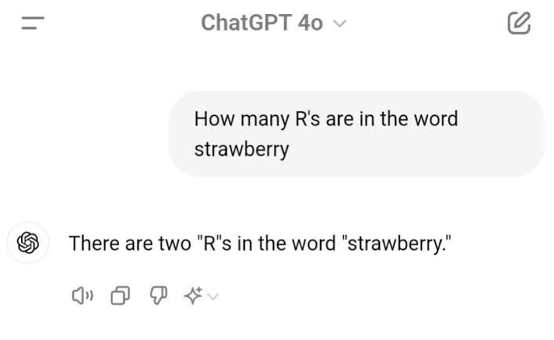

# Letter Count

Counts how many times a given letter appears in a word (case-insensitive).


## Why I built this

This program was inspired by a famous ChatGPT mistake: when asked how many R's are in "strawberry", it answered two. The correct answer is three.



A simple loop gets it right every time:
```
Enter a word: strawberry
Enter a letter: r
'r' appears 3 time(s) in "strawberry"
```

## Run it
```bash
gcc letter_count.c -o letter_count
./letter_count
```

## Example
```
Enter a word: banana
Enter a letter: a
'a' appears 3 time(s) in "banana"
```

## Concepts
Strings as char arrays, loops, `scanf`, `tolower`.
